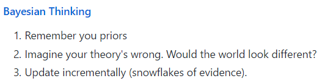

# 社会调查研究方法学习笔记

@(Statistics)

***
## 第一章 引言
本书所讲的研究方法面向管理学、心理学和其他社会科学，消费者心理学、组织行为学、管理信息系统、心理学、社会学、教育学中的一般性课题。

行为研究是研究人的态度、行为和观念。

社会调查方法 (survey) 是一种使用调查问卷来收集数据、对人的态度、行为、观念进行研究的定量方法。

我们将侧重于关于事物的状态与事物间关系的研究，也即关于 what 与 why 的问题。

统计学和心理计量学是主要的研究方法。

行为研究可以分为三类：
- 描述性演技
	- 汇报一个现象的各种统计参数
- 探索性研究
	- 对各变量之间的关系进行描述
- 验证性研究
	- 对一个现象作假设，然后使用统计方法进行假设检验（本书的重点）

一个研究课题可以简单地分为理论论证与实证研究两个部分。

假设检验往往需要定量的研究方法，常见的是问卷调查与实验设计。

逻辑性和可重复验证性是判断研究有效性（Validity）的核心。在行为研究中，主要是通过严谨的理论论证（基于概念的推导，三段论）与严谨的实证研究（收集
实际数据，并对推导的结论进行验证）来保证。
>   这种同时用逻辑与实证来保证知识的有效性的观点是欧洲文艺复兴以来的主流，并被冠以实证主义的名号（Positivism）。基于统计、可重复。
> 还有一种是个案研究（Case study），或叫基于情境的解释方法。解释主义（Interpretivism）。不可重复。

一个成功的科研项目往往会把它百分之七八十的时间花在立题与理论论证过程中，数据采集与数据分析往往只占一小部分。

